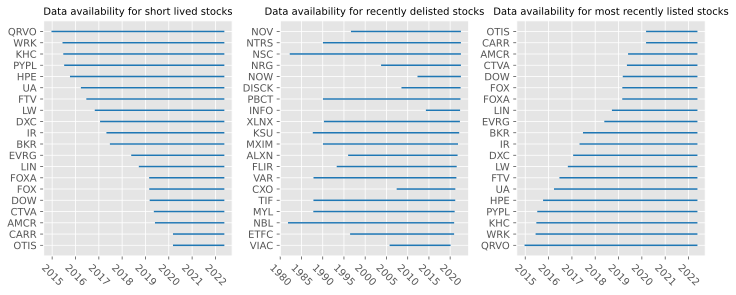
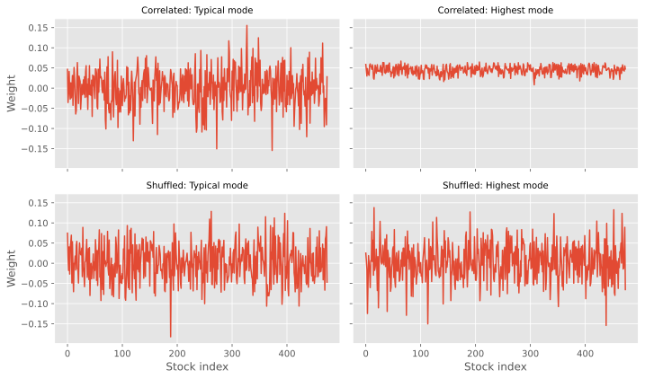
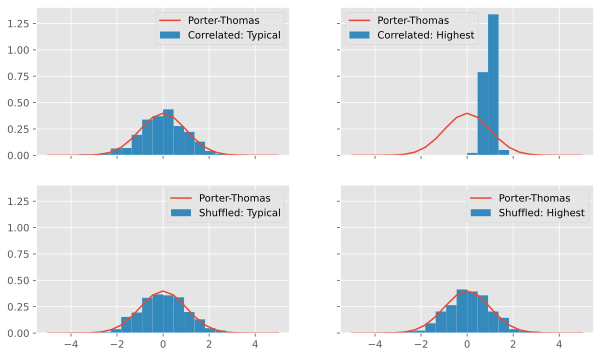
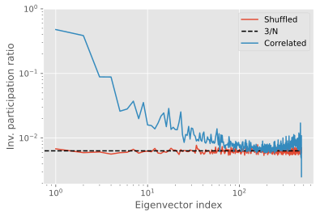
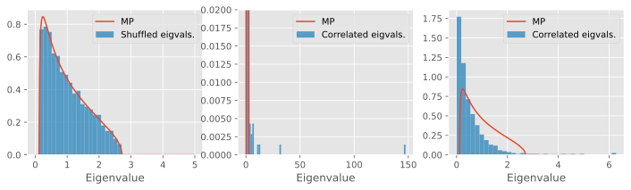
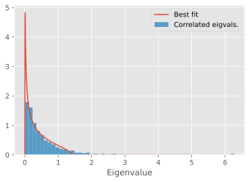
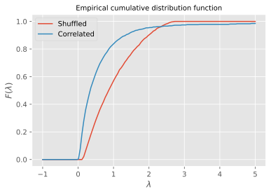
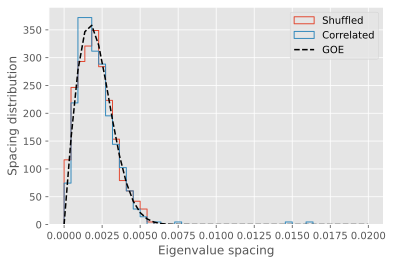
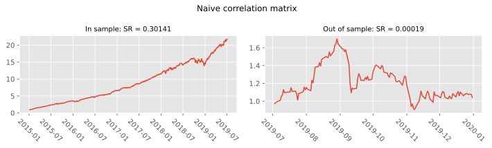
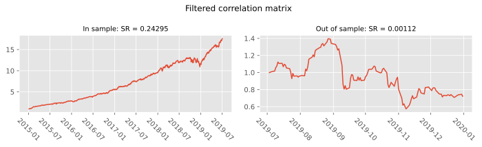

# Final project: Testing the Filtered Correlation Matrix approach
In this project I will collect the daily price data for the stocks in the S&P500 index over a period of about 4 years (2015-2019), and study the performance of an optimal portfolio (in the Markowitz sense) built using a "filtered" correlation matrix as in (Laloux, Laurent, et al. "Noise dressing of financial correlation matrices." PRL (1999)). Along the way I will check the applicability of random matrix theory to understand the structure of the correlation matrix.

I will use the python `tiingo` package (see [this repository](https://github.com/hydrosquall/tiingo-python)) to interface with the [Tiingo](https://www.tiingo.com/) API and collect historical data for the stocks we are interested in.

## Basic setup


```python
import matplotlib.pyplot as plt
import pandas as pd
import numpy as np
import statsmodels.api as sm
from tqdm.notebook import tqdm
import time
import glob
from scipy.optimize import minimize

%config InlineBackend.figure_formats = ['svg']
# plt.style.use("Solarize_Light2")
plt.style.use("ggplot")
```

```python
from tiingo import TiingoClient

with open("tiingo_token") as f:
    API_KEY = f.readline().strip()

# To reuse the same HTTP Session across API calls (and have better performance), include a session key.
config = {'session': True, 'api_key': API_KEY}

client = TiingoClient(config)
```

## Data collection 

In the next few cells we create a list of the tickers we are interested in, and then retrieve the corresponding metadata from Tiingo to make sure that the price data is available. I have already run this once, I kept this code here to show the method and for reproducibility purposes.


```python
with open("tickers_SP500.txt") as f:
    SP500 = f.readlines()
    
SP500 = [ticker.strip() for ticker in SP500] # clean up names removing whitespace and trailing newlines
```

Keep from the list of tickers only those that are listed in american exchanges (the Tiingo list includes some from ASX and some duplicate entries with no exchange listed).


```python
tickers = client.list_stock_tickers() # complete list of available stock tickers from Tiingo

tickers_sp500 = [ticker for ticker in tickers if ticker['ticker'] in SP500 and ticker["exchange"] in {'BATS', 'NASDAQ', 'NYSE', 'NYSE NAT', 'OTCMKTS'}]
```

We are interested in comparing historical data, so the best metric to understand what is going on is the [adjusted closing price](https://www.investopedia.com/terms/a/adjusted_closing_price.asp). 

To understand the correlations we work with returns rather than prices, so the large difference in absolute values between the stock prices does not actually matter.


```python
tickers_df = pd.DataFrame(tickers_sp500)
tickers_df.drop(["assetType","priceCurrency"],axis=1,inplace=True)
```

There are some duplicate tickers in the list given by the Tiingo API, so I have to clean that up. 

First, let's drop the tickers that have no listed startDate, as they are either double listed or broken. I will also remove duplicate entries from the dataframe and make sure that the dates are correctly formatted.


```python
tickers_df = tickers_df[tickers_df["startDate"]!='']
tickers_df['startDate'] = pd.to_datetime(tickers_df['startDate'])
tickers_df['endDate'] = pd.to_datetime(tickers_df['endDate'])
```


```python
tickers_df[tickers_df.duplicated(subset="ticker",keep=False)]
```


<div>
<style scoped>
    .dataframe tbody tr th:only-of-type {
        vertical-align: middle;
    }

    .dataframe tbody tr th {
        vertical-align: top;
    }

    .dataframe thead th {
        text-align: right;
    }
</style>
<table border="1" class="dataframe">
  <thead>
    <tr style="text-align: right;">
      <th></th>
      <th>ticker</th>
      <th>exchange</th>
      <th>startDate</th>
      <th>endDate</th>
    </tr>
  </thead>
  <tbody>
    <tr>
      <th>124</th>
      <td>DD</td>
      <td>NYSE</td>
      <td>2017-08-03</td>
      <td>2019-05-31</td>
    </tr>
    <tr>
      <th>125</th>
      <td>DD</td>
      <td>NYSE</td>
      <td>1962-01-02</td>
      <td>2022-05-09</td>
    </tr>
    <tr>
      <th>140</th>
      <td>DOW</td>
      <td>NYSE</td>
      <td>2019-03-20</td>
      <td>2022-05-09</td>
    </tr>
    <tr>
      <th>141</th>
      <td>DOW</td>
      <td>NYSE</td>
      <td>1972-06-01</td>
      <td>2017-08-31</td>
    </tr>
  </tbody>
</table>
</div>


```python
tickers_df.loc[142,'endDate'] = tickers_df.loc[141,'endDate'] 
tickers_df.drop([124,141],inplace=True)
```


```python
tickers_df.reset_index(drop=True,inplace=True)
tickers_df.head()
```


<div>
<style scoped>
    .dataframe tbody tr th:only-of-type {
        vertical-align: middle;
    }

    .dataframe tbody tr th {
        vertical-align: top;
    }

    .dataframe thead th {
        text-align: right;
    }
</style>
<table border="1" class="dataframe">
  <thead>
    <tr style="text-align: right;">
      <th></th>
      <th>ticker</th>
      <th>exchange</th>
      <th>startDate</th>
      <th>endDate</th>
    </tr>
  </thead>
  <tbody>
    <tr>
      <th>0</th>
      <td>A</td>
      <td>NYSE</td>
      <td>1999-11-18</td>
      <td>2022-05-09</td>
    </tr>
    <tr>
      <th>1</th>
      <td>AAL</td>
      <td>NASDAQ</td>
      <td>2005-09-27</td>
      <td>2022-05-09</td>
    </tr>
    <tr>
      <th>2</th>
      <td>AAP</td>
      <td>NYSE</td>
      <td>2001-11-29</td>
      <td>2022-05-09</td>
    </tr>
    <tr>
      <th>3</th>
      <td>AAPL</td>
      <td>NASDAQ</td>
      <td>1980-12-12</td>
      <td>2022-05-09</td>
    </tr>
    <tr>
      <th>4</th>
      <td>ABBV</td>
      <td>NYSE</td>
      <td>2013-01-02</td>
      <td>2022-05-09</td>
    </tr>
  </tbody>
</table>
</div>


Let's visualize what time interval is available for each stock. Some tickers have data that covers only a very short time frame. That's a mix of some companies being delisted and maybe some issues with the Tiingo API. We have to choose carefully what data to keep: we can only compute the correlations over the intersection of all time spans, so we are limited by the shortest one.

There is one stock listed for exactly two days. I'm not sure what happened there, but we are going to ignore it.


```python
tickers_df[tickers_df["ticker"]== "DISCA"]
```


<div>
<style scoped>
    .dataframe tbody tr th:only-of-type {
        vertical-align: middle;
    }

    .dataframe tbody tr th {
        vertical-align: top;
    }

    .dataframe thead th {
        text-align: right;
    }
</style>
<table border="1" class="dataframe">
  <thead>
    <tr style="text-align: right;">
      <th></th>
      <th>ticker</th>
      <th>exchange</th>
      <th>startDate</th>
      <th>endDate</th>
    </tr>
  </thead>
  <tbody>
    <tr>
      <th>131</th>
      <td>DISCA</td>
      <td>NASDAQ</td>
      <td>2022-04-06</td>
      <td>2022-04-08</td>
    </tr>
  </tbody>
</table>
</div>


```python
tickers_df.drop(131,inplace=True) # drop DISCA
tickers_df.reset_index(drop=True,inplace=True)
```

Let's add a column measuring the data coverage of each stock (number of daily closing prices available)


```python
tickers_df["deltaDate"] = tickers_df["endDate"] -  tickers_df["startDate"]
```


```python
tickers_df.sort_values("deltaDate")
tickers_df.drop(497,inplace=True)
```


```python
tickers_df.to_parquet("tickers_data_availability.parquet")
```

## Loading collected data and picking a time frame
We already collected the data, we can just read it now. The following is a list of available tickers, annotated with the time frame covered by the historical data. We have to pick a subset to use, to get an idea of what is feasible we make a Gantt chart.


```python
tickers_df = pd.read_parquet("tickers_data_availability.parquet")
```


```python
fig, ax = plt.subplots(1,3,figsize=(10,4))

died_early = tickers_df.sort_values("deltaDate").index

num = 20

for ticker in died_early[:num]:
    start = tickers_df.loc[ticker,"startDate"]
    end = tickers_df.loc[ticker,"endDate"]
    ax[0].plot([start,end],[tickers_df.loc[ticker,"ticker"],tickers_df.loc[ticker,"ticker"]],color="tab:blue")
    
ax[0].set_title("Data availability for short lived stocks",size=10);

delisted_early = tickers_df.sort_values("endDate").index

for ticker in delisted_early[:num]:
    start = tickers_df.loc[ticker,"startDate"]
    end = tickers_df.loc[ticker,"endDate"]
    
    ax[1].plot([start,end],[tickers_df.loc[ticker,"ticker"],tickers_df.loc[ticker,"ticker"]],color="tab:blue")
ax[1].set_title("Data availability for recently delisted stocks",size=10);

    
recently_listed = tickers_df.sort_values("startDate").index

for ticker in recently_listed[-num:]:
    start = tickers_df.loc[ticker,"startDate"]
    end = tickers_df.loc[ticker,"endDate"]
    ax[2].plot([start,end],[tickers_df.loc[ticker,"ticker"],tickers_df.loc[ticker,"ticker"]],color="tab:blue")
    
ax[2].set_title("Data availability for most recently listed stocks",size=10);

fig.tight_layout()

ax[0].tick_params(axis='x', labelrotation = -45)
ax[1].tick_params(axis='x', labelrotation = -45)
ax[2].tick_params(axis='x', labelrotation = -45)
```


    

    


The first plot on the left is of the stocks with fewest data available, the center one is for stocks that have been delisted recently, and the right one shows the stocks that have been most recently listed.

From this pictures it's clear that most stocks have consistent coverage after 2015. The 2008 financial crisis is far enough in the past that this data should be in "normal" conditions (not a crisis), and we have 5 years before the COVID19 pandemic, which should be enough to run a decent statistical analysis.

At this point we are ready to download the price data. We will download data from 2015 to the end of 2022Q1


```python
start_date = "2015-01-01"
end_date = "2022-03-31"
```

Let's do the downloading in chunks of 10 tickers and wait a little between them, I don't want Tiingo to ban me, and in case something goes wrong with the download we at least have partial data.


```python
# ticker_blocks = [tickers_df["ticker"][10*b:(10*(b+1) if 10*(b+1) < len(tickers_df.index) else None)] for b in range(len(tickers_df.index)//10 + 1)]
```


```python
# for n in tqdm(range(46,len(ticker_blocks))):
#     prices_df = client.get_dataframe(["MYL","VAR"],
#                                       frequency='daily',
#                                       metric_name='adjClose',
#                                       startDate=start_date,
#                                       endDate=end_date)
    
#     prices_df.to_parquet(f'prices_{n:02}.parquet')
    
#     time.sleep(1)
```

We had some issues with the tickers CX0, MYL, VAR. The API returns an empty JSON even if the ticker is in the list of available tickers. I also used their online interface, and it fails too. I am just going to ignore these three tickers.


```python
prices_df = pd.concat([pd.read_parquet(f) for f in glob.glob("data/*.parquet")],axis=1)
prices_df = prices_df[sorted(prices_df.columns)]
```


```python
prices_df.head()
```


<div>
<style scoped>
    .dataframe tbody tr th:only-of-type {
        vertical-align: middle;
    }

    .dataframe tbody tr th {
        vertical-align: top;
    }

    .dataframe thead th {
        text-align: right;
    }
</style>
<table border="1" class="dataframe">
  <thead>
    <tr style="text-align: right;">
      <th></th>
      <th>A</th>
      <th>AAL</th>
      <th>AAP</th>
      <th>AAPL</th>
      <th>ABBV</th>
      <th>ABC</th>
      <th>ABMD</th>
      <th>ABT</th>
      <th>ACN</th>
      <th>ADBE</th>
      <th>...</th>
      <th>XLNX</th>
      <th>XOM</th>
      <th>XRAY</th>
      <th>XRX</th>
      <th>XYL</th>
      <th>YUM</th>
      <th>ZBH</th>
      <th>ZBRA</th>
      <th>ZION</th>
      <th>ZTS</th>
    </tr>
  </thead>
  <tbody>
    <tr>
      <th>2015-01-02 00:00:00+00:00</th>
      <td>38.086143</td>
      <td>51.072326</td>
      <td>152.492927</td>
      <td>24.676380</td>
      <td>47.849994</td>
      <td>80.383789</td>
      <td>37.31</td>
      <td>38.966047</td>
      <td>78.357584</td>
      <td>72.340</td>
      <td>...</td>
      <td>38.330474</td>
      <td>65.946968</td>
      <td>49.386511</td>
      <td>29.269804</td>
      <td>34.702188</td>
      <td>45.094825</td>
      <td>103.267956</td>
      <td>77.43</td>
      <td>24.534098</td>
      <td>41.220420</td>
    </tr>
    <tr>
      <th>2015-01-05 00:00:00+00:00</th>
      <td>37.372497</td>
      <td>51.039169</td>
      <td>150.482897</td>
      <td>23.981207</td>
      <td>46.949494</td>
      <td>79.699558</td>
      <td>37.07</td>
      <td>38.974726</td>
      <td>77.034572</td>
      <td>71.980</td>
      <td>...</td>
      <td>37.622767</td>
      <td>64.142537</td>
      <td>49.044144</td>
      <td>28.631190</td>
      <td>32.542414</td>
      <td>44.178593</td>
      <td>107.120216</td>
      <td>76.34</td>
      <td>23.614828</td>
      <td>40.972964</td>
    </tr>
    <tr>
      <th>2015-01-06 00:00:00+00:00</th>
      <td>36.790313</td>
      <td>50.248121</td>
      <td>150.377106</td>
      <td>23.983464</td>
      <td>46.717106</td>
      <td>80.134978</td>
      <td>36.13</td>
      <td>38.532127</td>
      <td>76.478907</td>
      <td>70.530</td>
      <td>...</td>
      <td>37.082096</td>
      <td>63.801543</td>
      <td>48.435490</td>
      <td>28.248022</td>
      <td>32.351042</td>
      <td>43.636334</td>
      <td>106.212186</td>
      <td>75.79</td>
      <td>22.712903</td>
      <td>40.573228</td>
    </tr>
    <tr>
      <th>2015-01-07 00:00:00+00:00</th>
      <td>37.278597</td>
      <td>50.219700</td>
      <td>153.608541</td>
      <td>24.319765</td>
      <td>48.605253</td>
      <td>81.734479</td>
      <td>37.28</td>
      <td>38.844550</td>
      <td>78.084161</td>
      <td>71.110</td>
      <td>...</td>
      <td>37.095283</td>
      <td>64.448012</td>
      <td>49.690838</td>
      <td>28.609903</td>
      <td>32.606205</td>
      <td>45.082360</td>
      <td>108.853730</td>
      <td>77.72</td>
      <td>22.925376</td>
      <td>41.410770</td>
    </tr>
    <tr>
      <th>2015-01-08 00:00:00+00:00</th>
      <td>38.396016</td>
      <td>50.835486</td>
      <td>154.954972</td>
      <td>25.254186</td>
      <td>49.113600</td>
      <td>81.921087</td>
      <td>38.96</td>
      <td>39.642963</td>
      <td>79.274872</td>
      <td>72.915</td>
      <td>...</td>
      <td>37.921674</td>
      <td>65.520725</td>
      <td>50.917655</td>
      <td>29.397527</td>
      <td>32.852255</td>
      <td>45.867702</td>
      <td>110.009409</td>
      <td>79.38</td>
      <td>23.250589</td>
      <td>42.048445</td>
    </tr>
  </tbody>
</table>
<p>5 rows × 494 columns</p>
</div>


```python
returns_df = ((np.log(prices_df)).diff())[1:]
```


```python
returns_df.describe()
```


<div>
<style scoped>
    .dataframe tbody tr th:only-of-type {
        vertical-align: middle;
    }

    .dataframe tbody tr th {
        vertical-align: top;
    }

    .dataframe thead th {
        text-align: right;
    }
</style>
<table border="1" class="dataframe">
  <thead>
    <tr style="text-align: right;">
      <th></th>
      <th>A</th>
      <th>AAL</th>
      <th>AAP</th>
      <th>AAPL</th>
      <th>ABBV</th>
      <th>ABC</th>
      <th>ABMD</th>
      <th>ABT</th>
      <th>ACN</th>
      <th>ADBE</th>
      <th>...</th>
      <th>XLNX</th>
      <th>XOM</th>
      <th>XRAY</th>
      <th>XRX</th>
      <th>XYL</th>
      <th>YUM</th>
      <th>ZBH</th>
      <th>ZBRA</th>
      <th>ZION</th>
      <th>ZTS</th>
    </tr>
  </thead>
  <tbody>
    <tr>
      <th>count</th>
      <td>1824.000000</td>
      <td>1824.000000</td>
      <td>1824.000000</td>
      <td>1824.000000</td>
      <td>1824.000000</td>
      <td>1824.000000</td>
      <td>1824.000000</td>
      <td>1824.000000</td>
      <td>1824.000000</td>
      <td>1824.000000</td>
      <td>...</td>
      <td>1792.000000</td>
      <td>1824.000000</td>
      <td>1824.000000</td>
      <td>1824.000000</td>
      <td>1824.000000</td>
      <td>1824.000000</td>
      <td>1824.000000</td>
      <td>1824.000000</td>
      <td>1824.000000</td>
      <td>1824.000000</td>
    </tr>
    <tr>
      <th>mean</th>
      <td>0.000682</td>
      <td>-0.000564</td>
      <td>0.000167</td>
      <td>0.001072</td>
      <td>0.000664</td>
      <td>0.000359</td>
      <td>0.001197</td>
      <td>0.000607</td>
      <td>0.000799</td>
      <td>0.001009</td>
      <td>...</td>
      <td>0.000908</td>
      <td>0.000123</td>
      <td>-0.000002</td>
      <td>-0.000204</td>
      <td>0.000493</td>
      <td>0.000530</td>
      <td>0.000117</td>
      <td>0.000919</td>
      <td>0.000539</td>
      <td>0.000833</td>
    </tr>
    <tr>
      <th>std</th>
      <td>0.016092</td>
      <td>0.032923</td>
      <td>0.021150</td>
      <td>0.018316</td>
      <td>0.017812</td>
      <td>0.017939</td>
      <td>0.028704</td>
      <td>0.015394</td>
      <td>0.015220</td>
      <td>0.019841</td>
      <td>...</td>
      <td>0.022631</td>
      <td>0.017830</td>
      <td>0.018443</td>
      <td>0.023775</td>
      <td>0.016987</td>
      <td>0.016090</td>
      <td>0.017824</td>
      <td>0.024897</td>
      <td>0.022008</td>
      <td>0.016083</td>
    </tr>
    <tr>
      <th>min</th>
      <td>-0.116665</td>
      <td>-0.290682</td>
      <td>-0.227452</td>
      <td>-0.137708</td>
      <td>-0.177363</td>
      <td>-0.139624</td>
      <td>-0.336675</td>
      <td>-0.102982</td>
      <td>-0.087629</td>
      <td>-0.159525</td>
      <td>...</td>
      <td>-0.187258</td>
      <td>-0.130391</td>
      <td>-0.206306</td>
      <td>-0.208265</td>
      <td>-0.128143</td>
      <td>-0.208654</td>
      <td>-0.150756</td>
      <td>-0.272411</td>
      <td>-0.128362</td>
      <td>-0.158944</td>
    </tr>
    <tr>
      <th>25%</th>
      <td>-0.006758</td>
      <td>-0.014865</td>
      <td>-0.008785</td>
      <td>-0.006827</td>
      <td>-0.007091</td>
      <td>-0.007788</td>
      <td>-0.010119</td>
      <td>-0.006099</td>
      <td>-0.005603</td>
      <td>-0.006807</td>
      <td>...</td>
      <td>-0.009209</td>
      <td>-0.007944</td>
      <td>-0.008000</td>
      <td>-0.010225</td>
      <td>-0.007095</td>
      <td>-0.005637</td>
      <td>-0.007424</td>
      <td>-0.010116</td>
      <td>-0.010897</td>
      <td>-0.006420</td>
    </tr>
    <tr>
      <th>50%</th>
      <td>0.001429</td>
      <td>-0.000444</td>
      <td>0.000328</td>
      <td>0.000920</td>
      <td>0.001329</td>
      <td>0.000977</td>
      <td>0.001644</td>
      <td>0.000947</td>
      <td>0.001480</td>
      <td>0.001774</td>
      <td>...</td>
      <td>0.000900</td>
      <td>0.000000</td>
      <td>0.000831</td>
      <td>0.000615</td>
      <td>0.000619</td>
      <td>0.000708</td>
      <td>0.000317</td>
      <td>0.001182</td>
      <td>0.000943</td>
      <td>0.001101</td>
    </tr>
    <tr>
      <th>75%</th>
      <td>0.009348</td>
      <td>0.014126</td>
      <td>0.010384</td>
      <td>0.010161</td>
      <td>0.008785</td>
      <td>0.009310</td>
      <td>0.014947</td>
      <td>0.008919</td>
      <td>0.007904</td>
      <td>0.010493</td>
      <td>...</td>
      <td>0.011170</td>
      <td>0.008014</td>
      <td>0.008563</td>
      <td>0.010950</td>
      <td>0.009141</td>
      <td>0.007200</td>
      <td>0.008323</td>
      <td>0.012288</td>
      <td>0.011961</td>
      <td>0.008798</td>
    </tr>
    <tr>
      <th>max</th>
      <td>0.093849</td>
      <td>0.344278</td>
      <td>0.151299</td>
      <td>0.113157</td>
      <td>0.128985</td>
      <td>0.111677</td>
      <td>0.256793</td>
      <td>0.103783</td>
      <td>0.120954</td>
      <td>0.163133</td>
      <td>...</td>
      <td>0.169208</td>
      <td>0.119442</td>
      <td>0.162531</td>
      <td>0.122734</td>
      <td>0.106717</td>
      <td>0.209032</td>
      <td>0.144791</td>
      <td>0.158833</td>
      <td>0.214152</td>
      <td>0.113144</td>
    </tr>
  </tbody>
</table>
<p>8 rows × 494 columns</p>
</div>


## The pre-COVID period
Before starting the analysis we have to separate the data in a training and test set. First we will remove anything before 2020-01-01, which according to WHO is the [earliest date](https://www.who.int/news/item/29-06-2020-covidtimeline) they requested information about the cluster of pneumonia cases in Wuhan. This ensures we won't see any effect of the COVID pandemic in our analysis.

We keep 10% of the data as test set.

(Laloux et al. 1999) finds that using the sample correlation matrix one severly underestimates the realized risk, we will confirm this at the end of this section. 


```python
precovid_df = returns_df[:"2019-12-31"].dropna(axis=1,how="all") 
```

We dropped columns made of only NaNs, they correspond to companies that did not exist in the pre covid period.


```python
precovid_df.shape
```


    (1257, 492)


We're missing these many datapoints over this timeframe:


```python
v = precovid_df.isna().sum()
v = v[v>0]
v
```


    AMCR    1116
    BKR      630
    CTVA    1105
    DOW     1059
    DXC      524
    EVRG     860
    FOX     1054
    FOXA    1053
    FTV      377
    HPE      200
    IR       594
    KHC      126
    LIN      943
    LW       469
    PYPL     136
    UA       317
    VIAC      18
    WRK      119
    dtype: int64


so we might as well drop these companies.


```python
precovid_df.drop(v.index,inplace=True,axis=1)
```

### Random matrix behavior
Let's compare the properties of the correlation matrix with the predictions of random matrix theory. If the time series were independent the correlation matrix would be a Wishart matrix, but the fluctuations of the returns are correlated so we expect deviations from random matrix behavior.

To check that the deviations from random matrix theory are indeed due to correlations we shuffle each time series independently, which breaks any correlation and gives us a benchmark of what to expect. We then compare to the actual data to highlight the effect of correlations.


```python
train_df = precovid_df[:-126]
test_df = precovid_df[-126:]
```


```python
data = train_df.reset_index(drop=True)

T,N = data.shape

# pandas really doesn't like when I try to shuffle each column independently
data_shuffled = data.copy()

for col in data.columns:
    data_shuffled[col] = data_shuffled[col].sample(frac=1).reset_index(drop=True)

# correlation matrice
R = data.corr()
R_shuffled = data_shuffled.corr()
```


```python
R.shape
```


    (474, 474)


```python
# check we don't have any nans in the correlation matrix
assert R.isna().sum().sum()==0, "There are NaNs in the correlation matrix."
```


```python
eigvals, eigvecs = np.linalg.eigh(R)
eigvals_shuffled, eigvecs_shuffled = np.linalg.eigh(R_shuffled)
```

Let's look at the largest eigenvalues: in the shuffled case the largest eigenvalue is around 3, while in the correlated one the largest eigenvalues are about 50 times larger than that!


```python
eigvals_shuffled[-5:]
```


    array([2.56355697, 2.59809956, 2.6219893 , 2.64019484, 2.70640352])


```python
eigvals[-5:]
```


    array([  7.06655253,  10.36404447,  13.21764698,  31.74111172,
           147.40462212])


#### Eigenvectors
In the random matrix case we expect the component of each eigenvector to be Porter-Thomas distributed (which is just another name for a Gaussian distribution). Let's look at the eigenvectors corresponding to the largest eigenvalue and an eigenvalue in the middle of the spectrum: we expect the extreme eigenvalue to be *not* random, and the one in the middle of the spectrum to be "typical" in some sense, and close to the random matrix prediction.


```python
vmax = eigvecs[:,-1]
vmid = eigvecs[:,100]

vmax_shuffled = eigvecs_shuffled[:,-1]
vmid_shuffled = eigvecs_shuffled[:,100]
```


```python
fig,ax = plt.subplots(2,2,figsize=(10,6),sharey=True,sharex=True)

ax[0,0].plot(vmid,label="Middle of the spectrum")
ax[0,0].set_title("Correlated: Typical mode",size=10)

ax[0,1].plot(vmax,label="Largest eigenvalue")
ax[0,1].set_title("Correlated: Highest mode",size=10)

ax[1,0].plot(vmid_shuffled,label="Middle of the spectrum")
ax[1,0].set_title("Shuffled: Typical mode",size=10)

ax[1,1].plot(vmax_shuffled,label="Largest eigenvalue")
ax[1,1].set_title("Shuffled: Highest mode",size=10)

ax[1,0].set_xlabel("Stock index")
ax[0,0].set_ylabel("Weight")
ax[1,0].set_ylabel("Weight")
ax[1,1].set_xlabel("Stock index")

fig.tight_layout();
```


    

    


Here and in the following "correlated" means it has been computed using the actual data, while "shuffled" using the shuffled one.

Notice how in the shuffled case the mid-spectrum and the highest eigenvectors look exaclty the same, while in the correlated case the highest mode is more uniform than all other vectors: it is the market mode. To be a little more precise about this, let's look at the distributions of the components, and compare to Porter-Thomas


```python
fig,ax = plt.subplots(2,2,figsize=(10,6),sharey=True,sharex=True)

bins,dx = np.linspace(-5,5,23,retstep=True)

ax[0,0].plot(bins,1/np.sqrt(2*np.pi)*np.exp(-(bins**2)/2),label="Porter-Thomas")
ax[0,1].plot(bins,1/np.sqrt(2*np.pi)*np.exp(-(bins**2)/2),label="Porter-Thomas")
ax[1,0].plot(bins,1/np.sqrt(2*np.pi)*np.exp(-(bins**2)/2),label="Porter-Thomas")
ax[1,1].plot(bins,1/np.sqrt(2*np.pi)*np.exp(-(bins**2)/2),label="Porter-Thomas")

ax[0,0].hist(vmid*np.sqrt(N) ,bins=bins,density=True,label="Correlated: Typical")
ax[0,1].hist(vmax*np.sqrt(N) ,bins=bins,density=True,label="Correlated: Highest")
ax[1,0].hist(vmid_shuffled*np.sqrt(N) ,bins=bins,density=True,label="Shuffled: Typical")
ax[1,1].hist(vmax_shuffled*np.sqrt(N) ,bins=bins,density=True,label="Shuffled: Highest")

ax[0,0].legend();
ax[1,0].legend();
ax[0,1].legend();
ax[1,1].legend();
```


    

    


This is more evidence that in the correlated case the bulk of the spectrum is close to random (and thus does not contain much information), while the top edge of the spectrum has nontrivial information. 

As many authors have pointed out (Laloux, Pleroux, Kondor) the low lying eigenvectors are more sensitive to noise. A good diagnostics is the inverse participation ratio:


```python
def IPR(u):
    # inverse participation ratio of the array u
    return np.sum(u**4)
```


```python
iprs = [IPR(u) for u in eigvecs.T]
iprs_shuffled = [IPR(u) for u in eigvecs_shuffled.T]
```


```python
plt.plot(range(1,N+1),iprs_shuffled,label="Shuffled")
plt.plot(3/N*np.ones_like(iprs),color="black",linestyle='--',label="3/N")
plt.loglog(range(1,N+1),iprs,label="Correlated")
plt.xlabel("Eigenvector index")
plt.ylabel("Inv. participation ratio")
plt.ylim(top=1)
plt.legend();
```


    

    


The expected IPR is 3/N for Gaussian entries in the vector: by Wick's theorem $\mathbb{E}[x^4] = 3 \mathbb{E}[x^2]$ when $x$ is a Gaussian random variable with zero mean. It's clear that the low lying eigenvectors of the correlation matrix are localized (a few large entries in the vector give a large contribution to IPR), which makes them very sensitive to noise: a small fluctuation in the few stock having most of the weight is amplified. 

From these pictures we conclude that the extremal eigenvectors of the correlation matrix do *not* follow random matrix theory, while the structure of the middle of the spectrum is reasonably well captured.

#### Eigenvalues
The empirical correlation matrix is a Wishart matrix, so we expect the eigenvalues to be Marchenko-Pastur distributed. In the large N limit the support of the distribution is compact, but at finite N we expect some eigenvalues outside the edges of the Marchenko-Pastur curve.


```python
def MP(l,Q,sigma):
    lmax = sigma**2 * (1 + 1/Q + 2 * np.sqrt(1/Q))
    lmin = sigma**2 * (1 + 1/Q - 2 * np.sqrt(1/Q))
    
    if hasattr(l, '__iter__'):
        return [MP(l,Q,sigma) for l in l]
    else:
        if l > lmax or l < lmin: 
            return 0
        else:
            return Q/(2*np.pi*sigma**2*l) * np.sqrt((lmax - l)*(l-lmin)) 
    
def MP_supp(Q,sigma):
    lmax = sigma**2 * (1 + 1/Q + 2 * np.sqrt(1/Q))
    lmin = sigma**2 * (1 + 1/Q - 2 * np.sqrt(1/Q))
    
    return lmin,lmax
```

The Marchenko-Pastur distribution depends on two parameters only:


```python
Q = data.shape[0]/data.shape[1]
Q
```


    2.3860759493670884


```python
sigma = 1 # we are working with the correlation matrix, the variance has been rescaled to unity
```

The edges of the spectrum for these parameters are 


```python
lmin,lmax = MP_supp(Q,sigma)
print(lmin,lmax)
```

    0.12434234659166576 2.713853939880483


```python
x = np.linspace(0,5,256)
mp = MP(x,Q,sigma) 

fig,ax = plt.subplots(1,3,figsize=(12,3))


ax[0].plot(x,mp,label="MP")
ax[1].plot(x,mp,label="MP")
ax[2].plot(x,mp,label="MP")

ax[0].hist(eigvals_shuffled,bins=20,density=True,label="Shuffled eigvals.",alpha=0.8)

ax[1].hist(eigvals,bins=100,density=True,label="Correlated eigvals.",alpha=0.8)
ax[1].set_ylim(top=0.02)

ax[2].hist(eigvals[:-5],bins=35,density=True,label="Correlated eigvals.",alpha=0.8)

ax[0].set_xlabel("Eigenvalue")
ax[1].set_xlabel("Eigenvalue")
ax[2].set_xlabel("Eigenvalue")

ax[0].legend();
ax[1].legend();
ax[2].legend();
```


    

    


The plot on the right is the spectral density in the correlated case after dropping the 5 largest eigenvalues. It's clear there is still a significant deviation from the random matrix prediction. It looks closer to a power law distribution than a Marchenko-Pastur.

Cheating: what if we let $Q$ and $\sigma$ be fit parameters?


```python
from scipy.optimize import curve_fit
```


```python
hist,bins = np.histogram(eigvals[:-5],bins=35,density=True)
```


```python
bins = 0.5*(bins[1:] + bins[:-1])
```


```python
popt,pcov = curve_fit(MP,xdata=bins,ydata=hist,p0=[Q,1],bounds=[[0,0],[np.inf,np.inf]])
```


```python
popt
```


    array([1.21835126, 0.62188429])


```python
x = np.linspace(0,5,1024)
plt.plot(x,MP(x,*popt),label="Best fit")
plt.hist(eigvals[:-5],bins=55,density=True,label="Correlated eigvals.",alpha=0.8)
plt.xlabel("Eigenvalue")
plt.legend();
```


    

    


Better, but there is still a a deviation from MP, and it's hard to justify why Q should be reduced to about 1.32 (it's almost a factor of 2) and $\sigma$ to roughly 0.66. It's true that dropping some eigenvalues we lose some variance from the matrix, but we have to be careful: what features of the correlation matrix do we want to preserve after ignoring part of the spectrum? A common prescription is to preserve the trace (so the total variance), but it's not so clear cut, and other procedures have been devised (Pafka&Kondor, Physica A 2004).

What this fit does is an idea of the "random band" of the spectrum: in the following analysis we will remove the eigenvalues in this interval and reconstruct the correlation matrix without them.

It means that we have to drop the first 430 or so eigenvalues: comparing the spectrum to the support of MP we have


```python
MP_supp(*popt)
```


    (0.0034194283780776065, 1.4049188116681302)


```python
eigvals[430]
```


    1.3847006858534916


#### Eigenvalue spacings
Another test to diagnose this deviation from RMT is the level spacing: first we have to unfold the spectrum (work with the comulative distribution rather than the eigenvalue density), then compare to the GOE result


```python
def cdf(x,v):
    # given the array v computes the fraction
    # of entries of v smaller than x
    
    N = len(v)
    
    if hasattr(x,'__iter__'):
        return [cdf(x,v) for x in x]
    else:
        return np.sum(v < x)/N
```


```python
x = np.linspace(-1,5,120)
plt.plot(x,cdf(x,eigvals_shuffled),label="Shuffled")
plt.plot(x,cdf(x,eigvals),label="Correlated")
plt.xlabel(r"$\lambda$")
plt.ylabel(r"$F(\lambda)$")
plt.title("Empirical cumulative distribution function",size=10)
plt.legend();
```


    

    


To complete the spectral unfolding we interpolate these CDFs and look at the spacings between $\epsilon_i = F(\lambda_i)$, where $\lambda_i$ are the observed eigenvalues.


```python
from scipy.interpolate import interp1d
```


```python
interp_cdf_shuffled = interp1d(x,cdf(x,eigvals_shuffled),kind="linear",fill_value=(0,1),bounds_error=False)
interp_cdf = interp1d(x,cdf(x,eigvals),kind="cubic",fill_value=(0,1),bounds_error=False)
```


```python
def wigner_surmise(s):
    return np.pi*s/2 * np.exp(-0.25*np.pi*s**2)
```


```python
bins = np.linspace(0,0.02,45)
plt.hist(np.diff(interp_cdf_shuffled(eigvals_shuffled)),
         density=True,bins=bins,
         alpha=1,
         label="Shuffled",
         histtype="step",
         align="mid",
         linewidth=1);

plt.hist(np.diff(interp_cdf(eigvals)),
         density=True,
         bins=bins,
         alpha=1,
         label="Correlated",
         histtype="step",
         align="mid",
         linewidth=1)

plt.plot(bins,wigner_surmise(bins*N)*N,label="GOE",color="black",linestyle="--")

plt.ylabel("Spacing distribution")
plt.xlabel("Eigenvalue spacing")
plt.legend();
```


    

    


The correlated data has a few unusually large spacings, but the bulk behavior is hard to distinguish from the one predicted by the GOE ensemble. This is interesting: the other indicators (spectral density, eigenvector component statistics, inverse participation ratio) showed clear deviations from the random matrix behavior, why doesn't the spacing? A good starting point for further analysis.

### Filtering the correlation matrix
Finally it's time to filter the matrix (remove the random eigenvalues) and compare to a more naive Markowitz optimization.

#### Testing
First, let's see how the optimal Markowitz portfolio performs if we use the naive correlation matrix:


```python
mu = train_df.mean() # average returns over training period
```


```python
def nSR(w,mu,C,L1):
    # computes negative Sharpe ratio of the portfolio w
    # with returns mu and covariance matrix C
    # This actually computes the sharpe ratio *squared* for numerical stability
    return  -(w@mu)**2/(w@C@w) + L1*np.sum(np.abs(w))

def weight_constraint(w):
    return np.sum(w) - 1
```


```python
C = train_df.cov()
```


```python
res = minimize(nSR,x0=np.ones_like(mu),args=(mu,C,0),constraints=({"type":"eq","fun":weight_constraint},),tol=1e-12)
wopt = res.x
assert np.allclose(np.sum(wopt),1)
```

Let's look at how the portfolio does in and out of sample


```python
realized_mu = test_df.mean()
realized_C = test_df.cov()

SR = -nSR(wopt,realized_mu,realized_C,0)
SRopt = -nSR(wopt,mu,C,0)
```


```python
fig,ax = plt.subplots(1,2,figsize=(10,3))

ax[0].plot(np.sum(wopt[None,:]*np.cumprod(np.exp(train_df),axis=0),axis=1))
ax[0].set_title(f"In sample: SR = {SRopt:.5f}",size=10)
ax[0].tick_params(axis='x', labelrotation = -45)

ax[1].plot(np.sum(wopt[None,:]*np.cumprod(np.exp(test_df),axis=0),axis=1))
ax[1].set_title(f"Out of sample: SR = {SR:.5f}",size=10)
ax[1].tick_params(axis='x', labelrotation = -45)

fig.suptitle("Naive correlation matrix")
fig.tight_layout();
```


    

    


The naive optimization procedure severly overfits. We could add a penalty to help with overfitting, but to keep the comparison fair I will not. Let's check what happens filtering the correlation matrix. 


```python
Cvals, Cvecs = np.linalg.eigh(C)
```


```python
# we drop the first k eigenvalues
k = 435
random_band = Cvals[:k]
Cvals[:k] = np.mean(random_band)

filtered_C = Cvecs@np.diag(Cvals)@np.conj(Cvecs.T)
```


```python
res = minimize(nSR,x0=np.ones_like(mu),args=(mu,filtered_C,0),constraints=({"type":"eq","fun":weight_constraint},),tol=1e-12)
wopt = res.x
assert np.allclose(np.sum(wopt),1)
```

Let's look at how the portfolio does in and out of sample


```python
realized_mu = test_df.mean()
realized_C = test_df.cov()

SR = -nSR(wopt,realized_mu,realized_C,0)
SRopt = -nSR(wopt,mu,filtered_C,0)
```


```python
fig,ax = plt.subplots(1,2,figsize=(10,3))

ax[0].plot(np.sum(wopt[None,:]*np.cumprod(np.exp(train_df),axis=0),axis=1))
ax[0].set_title(f"In sample: SR = {SRopt:.5f}",size=10)
ax[0].tick_params(axis='x', labelrotation = -45)

ax[1].plot(np.sum(wopt[None,:]*np.cumprod(np.exp(test_df),axis=0),axis=1))
ax[1].set_title(f"Out of sample: SR = {SR:.5f}",size=10)
ax[1].tick_params(axis='x', labelrotation = -45)

fig.suptitle("Filtered correlation matrix")
fig.tight_layout();
```


    

    


The return of the portfolio is worse, but the Sharpe ratio is almost a factor of 10 better, which means that this filtering technique -at least in this case- does not underestimate risk as badly as the naive approach.

This is far from a statistically satisfying statement, but it shows one example where correlation filtering is effective.

In conclusion, I have explored some applications of random matrix theory to the correlation matrix of stock prices over the period 2015-2019, and using the filtering technique proposed in 1999 by Laloux et al. I have showed that it improves over a naive Markowitz approach.
